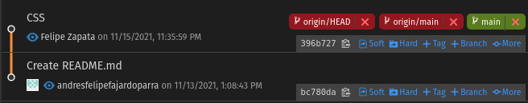
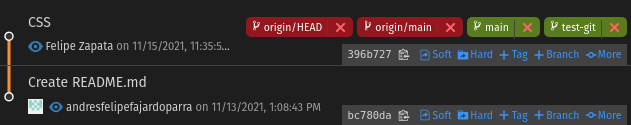
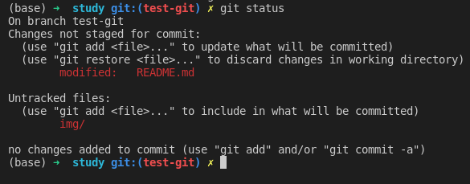
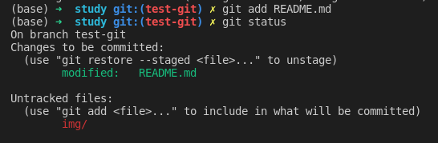
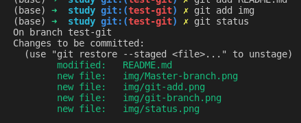
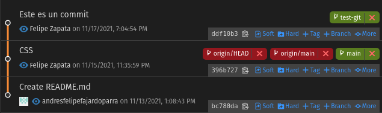
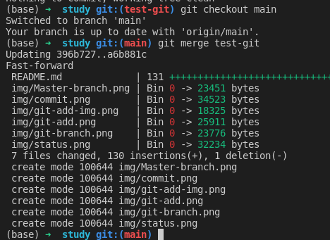
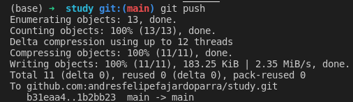

# Notas Clases Andrés Felipe Fajardo :man-student:

- [Notas Clases Andrés Felipe Fajardo :man-student:](#notas-clases-andrés-felipe-fajardo-man-student)
- [Frontend I](#frontend-i)
  - [CSS](#css)
    - [Selectores](#selectores)
    - [Como se usan los selectores](#como-se-usan-los-selectores)
    - [Propiedades basicas](#propiedades-basicas)
- [Git](#git)
  - [Conceptos](#conceptos)
    - [Repositorio](#repositorio)
    - [Branch o rama](#branch-o-rama)
    - [Status](#status)
    - [Add](#add)
    - [Commit](#commit)
    - [Merge](#merge)
    - [Push](#push)
    - [Pull](#pull)
    - [Merge](#merge-1)
    - [Revert](#revert)
    - [Merge o unión](#merge-o-unión)
    - [Push](#push-1)
    - [Pull](#pull-1)
    - [Commit](#commit-1)
    - [Status](#status-1)
    - [Add](#add-1)

# Frontend I

## CSS

### Selectores

Los selectores se utilizan, como su nombre lo indica, para seleccionar elementos en el HTML previamente creado. Te escribo una selección rápida de selectores sacada de [esta página](https://www.w3schools.com/cssref/css_selectors.asp).

Los ejemplos van a estar orientados al siguiente codigo HTML

```
<HTML>
  <head>
    <title>Prueba</title>
  </head>
  <body>
    <h1 id="heading-principal">Titulo</h1>
    <p>Primera division</p>
    <ul class="lista-no-ordenada">
      <li class="item-lista primer-item">
        <p>Primer item, segunda división</p>
      </li>
      <li class="item-lista">Item 2</li>
      <li class="item-lista">Item 3</li>
    </ul>
    <p>Tercera división</p>
  </body 
</HTML>
```

| Selector | Ejemplo | Descripción del ejemplo |
| ----------- | ----------- | ----------- | 
| .clase | .item-lista | Selecciona todos los items que contienen la clase ```item-lista```. 3 elementos en este caso
| .clase1.clase2 | .item-lista.primer-item | Selecciona solo ```<li class="item-lista primer-item">Item 1</li>``` porque es el único que contiene las dos clases
| #id | #heading-principal | Selecciona el item que contiene el id ```heading-principal```, en este caso es ```<h1 id="heading-principal">Titulo</h1>```
| * | * | Selecciona todos los elementos
| element | li | Selecciona todos los elementos ```li```, 3 en este caso
| element > element | li > p | Selecciona todos los elementos ```p``` cuyo padre inmediato sea un elemento ```li```. En este caso sería ```<p>Primer item, segunda división</p>```, excluyendo ```<p>Primera division</p>``` porque su padre no es un elemento ```<li>```
| element + element | h1 + p | Selecciona todos los elementos ```p``` cuyo elemento inmediatamente anterior sea un ```h1```, en este caso sería solamente ```<p>Primera division</p>```
| element ~ element | h1 ~ p | Selecciona todos los elementos ```p``` cuyo elemento hermano (en el mismo nivel) sea un ```h1```, en este caso sería ```<p>Primera division</p>``` y ```<p>Tercera división</p>```
| element element | ul li | Seleccionan todos los elementos ```li``` cuyo padre, no necesariamente inmediato, sea ```ul```

### Como se usan los selectores

La sintaxis basica de una regla CSS es la siguiente

```
selector {
  color: #000,
  font-size: 14px
}
```

### Propiedades basicas

Algunas propiedades basicas

| Propiedad | Ejemplo | Descripción del ejemplo |
| ----------- | ----------- | ----------- | 
| color | color: #000 | Pone el texto en negro a los elementos seleccionados, el color se puede poner en hexadecimal o en texto para colores basicos (red, white, black, blue, etc.)
| font-size | font-size: 13px | Pone el texto en un tamaño de 13 pixeles a los elementos seleccionados
| background-color | background-color: red | Pone el color de fondo rojo para los elementos seleccionados
| border | border: 1px solid blue | Es un wrapper de varias propiedades ```border-width```, ```border-style```, ```border-color```. Pone un borde de un ancho de 1 pixel, borde solido (sin puntos ni guiones) y de color azul a los elementos seleccionados
| z-index | z-index: 200 | Sobrepone el elemento seleccionado sobre elementos con menor ```z-index```
| height | height: 200px | Hace que el alto del elemento seleccionado sea de 200 pixeles
| width | width: 100px | Hace que el ancho del elemento seleccionado sea de 100 pixeles
| position | position: relative | Determina la posición de un elemento. Se explica en detalle en el siguiente parrafo

Uno de los mas importantes es ```position```, a continuación los valores que puede tener:
- ```position: static``` es el valor por defecto, el elemento sigue el flujo regular.
- ```position: relative``` igual a estatico pero se puede ajustar la posición usando adicionalmente las propiedades ```top, right, bottom, left```.
- ```position: absolute``` el elemento se saca del flujo del documento. Se deben usar las propiedades ```top, right, bottom, left``` para ubicarlo
- ```position: fixed``` igual que absolute pero el elemento no se mueve con el scroll, queda fijo en la pantalla

# Git

Git es un software de control de versiones basado en ramas. Github es una aplicación que usa el software Git como base. Para esta sección te recomiendo instalar la aplicación [Git history](https://marketplace.visualstudio.com/items?itemName=donjayamanne). Las imagenes van a ser sacadas de esa extensión.

## Conceptos

### Repositorio

Es la colección de archivos o datos, contiene todas las ramas y permisos. En este caso el repositorio es https://github.com/andresfelipefajardoparra/study.

### Branch o rama

Podemos entender un repositorio como un arbol. Cuando se crea un repositorio, este inicialmente cuenta con una rama (o branch) ```main``` o ```master```. Esta es el tronco del arbol, todas las demás ramas tienen como función alimentar el tronco del arbol, que es una analogía a que todas las ramas se crean para que eventualmente su información llegue a la rama ```main```.



A partir de esta rama ```main``` vamos a crear una nueva rama que se va a llamar ```test-git```. Para hacer esto vamos a usar el comando ```git checkout -b test-git```.



Esta nueva rama va a ser una copia identica de la rama main. Se toma como buena practica crear una nueva rama cada vez que se va a iniciar la codificación de una nueva característica para la aplicación.

### Status

En cualquier momento, en la consola de git podemos ejecutar el comando ```git status``` que nos va a indicar el estado actual de nuestros cambios en la rama.



En este caso, el comando me indica que he hecho cambios (modified) un archivo que ya se encontraba en la lista de archivo, como es el caso del archivo ```README.md```. Adicionalmente me indica que se han modificado unos archivos que no se encontraban previamente en el repositorio, este es el caso de la carpeta ```img/``` y todo su contenido.

### Add

Para preparar los archivos para ser guardados debemos ejecutar el comando ```git add``` seguido del nombre del archivo. En este caso ejecutamos ```git add REAME.md```. Ejecutando nuevamente el comando ```git status``` verificamos el estado de nuestra rama.



Podemos ver que el archivo ```README.md``` paso a un estado de preparación o ```stage```, lo que quiere decir que está listo para agregarse al ```commit```.

Procedemos ahora a agregar la carpeta ```img/```


Cabe resaltar que en el momento en el que se agrega una carpeta, todos los archivos que esa carpeta contenga se agregan al estado de preparación o ```stage```.



### Commit

Un commit se puede asemejar a una foto, es una captura de los archivos del repositorio en un momento específico en el tiempo. 

Después de conocer cual es el estado actual de los archivos y haberlos incluido en el estado depreparación o ```stage```, vamos a ejecutar el comando ```git commit -m 'Este es un commit'``` para realizar el commit. En la extensión Git history podemos ver el resultado.



La bandera ```-m``` permite agregar un comentario al commit, en este caso es 'Este es un commit'.

### Merge

Para que los cambios de la rama ```test-git``` sean visibles en la rama ```main``` debemos hacer una unión o un ```merge```. Para hacerlo debemos primero ejecutar el comando ```git checkout main``` para poder situarnos en la rama principal, que es la que va a recibir los cambios. Luego ejecutamos el comando ```git merge test-git```.



Hemos hecho un merge de la rama ```test-git``` en la rama ```main``` y ahora la rama ```main``` contiene los commits que hicimos en la rama ```test-git```.

### Push

Para que los cambios en la rama ```main``` sean visibles en el repositorio principal, debemos ejecutar el comando ```git push```.



En este caso, el comando me indica que he hecho un push de la rama ```test-git``` al repositorio principal, es decir, que se han agregado los cambios de la rama ```test-git``` al repositorio principal.

### Pull

Para ver los cambios que se han hecho en la rama ```test-git``` podemos ejecutar el comando ```git pull```.


En este caso, el comando me indica que he hecho un pull de la rama ```test-git``` del repositorio principal.

### Merge

Para que los cambios de la rama ```test-git``` sean visibles en la rama ```main``` podemos ejecutar el comando ```git merge test-git```.


En este caso, el comando me indica que he hecho un merge de la rama ```test-git``` en la rama ```main```.

### Revert

Para revertir los cambios de la rama ```test-git``` podemos ejecutar el comando ```git revert```.


En este caso, el comando

### Merge o unión

### Push

### Pull

### Commit

### Status

### Add
